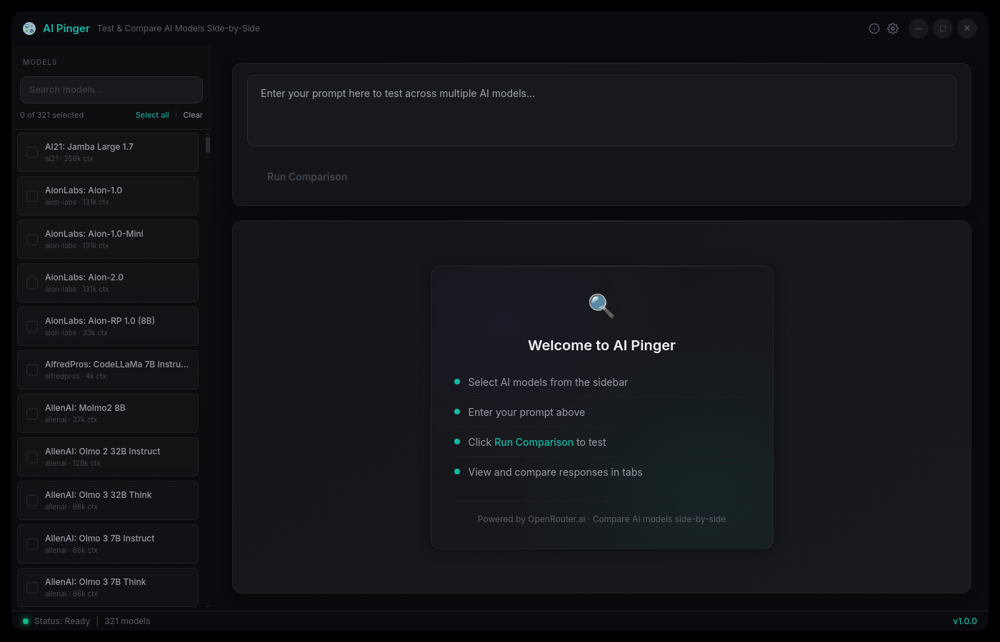

# AI Pinger


<p align="center">
  
</p>

A desktop app for testing multiple AI models from OpenRouter.ai with the same prompt and comparing their responses side-by-side. Built with Electron, React, and TypeScript using the Neo-Noir Glass Monitor design system.

## Quick Start

```bash
# Linux
./run-source-linux.sh

# macOS
./run-source-mac.sh

# Windows
run-source-windows.bat

# Or manually
npm install
npx electron-forge start
```

## Features

- **Multi-Model Testing** - Send the same prompt to multiple AI models at once
- **Side-by-Side Comparison** - View responses from different models in tabbed panels
- **Model Browser** - Browse and filter all available OpenRouter.ai models with pricing info
- **Auto API Key Detection** - Reads `OPENROUTER_API_KEY` from env vars, `.bashrc`, `.zshrc`
- **HTML & JSON Export** - Generate styled comparison reports or raw JSON data
- **Progress Tracking** - Real-time progress updates as each model responds
- **Persistent Settings** - Saves API key, selected models, and recent prompts
- **Neo-Noir Glass UI** - Dark glassmorphism design with teal accents and floating panel effect

## Technology Stack

- **Runtime**: Electron 33 (Chromium-based desktop app)
- **Frontend**: React 18 + TypeScript 5.7
- **State Management**: Zustand 5
- **Styling**: Tailwind CSS 3.4 + custom CSS variables (95+ design tokens)
- **Build System**: Electron Forge 7.6 + Vite
- **API**: OpenRouter.ai REST API (`/v1/models`, `/v1/chat/completions`)

## Project Structure

```
ai-pinger/
  src/
    main/               # Electron main process
      index.ts          # App entry, window creation, IPC setup
      preload.ts        # Context bridge (electronAPI)
      ipc-handlers.ts   # IPC channel handlers
      menu.ts           # Application menu
      services/         # Backend services
        openrouter-client.ts   # OpenRouter API calls + model cache
        pinger-service.ts      # Sequential model comparison runner
        settings-service.ts    # JSON settings persistence
        report-generator.ts    # HTML/JSON export
        api-key-detector.ts    # Auto-detect API key from env/shell
    renderer/           # React frontend
      App.tsx           # Root component with sidebar resize
      main.tsx          # React DOM entry
      stores/           # Zustand state stores
      hooks/            # Custom React hooks
      components/
        layout/         # TitleBar, Sidebar, MainPanel, StatusBar, AboutModal
        models/         # ModelCard, ModelList, ModelControls
        prompt/         # PromptInput, ActionButtons
        responses/      # ResponsePanel, ResponseTabs, WelcomeTab
        settings/       # SettingsModal
        shared/         # Button, GlassCard, Input, Modal, Spinner, Tabs, Tag, Toast
      styles/           # globals.css, design-tokens.ts
    shared/             # Shared between main/renderer
      types.ts          # AIModel, ModelResponse, ComparisonProgress, AppSettings
      constants.ts      # API URLs, app metadata, defaults
  config/settings.json  # User settings (API key, theme, selected models)
  templates/            # HTML report template
  resources/            # Icons and screenshots
```

## Documentation

- [Installation](./docs/INSTALLATION.md) - Setup and system requirements
- [Architecture](./docs/ARCHITECTURE.md) - System design and data flow
- [Development](./docs/DEVELOPMENT.md) - Dev environment and contributing
- [CLAUDE.md](./CLAUDE.md) - AI agent development guidelines

## Author

**J. Michaels** -- [GitHub](https://github.com/sanchez314c)

## License

MIT License - see [LICENSE](LICENSE) for details.
